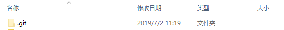

git学习
- ## 创建本地仓库
   - 本地仓库初始化

      - 示例:
      ```
      git init 
      ```
      - 效果：

      >本地文件夹多出一个 .git 隐藏文件 如下：
      

   - 本地仓库设置签名

     - 局部签名

        - 示例代码
       
        // git config user.name 要设置的用户名
         ```
         git config user.name aubrey
         ```
        // git config user.email 要设置的邮箱地址
        ```
         git config user.email test@test.com
        ```
     - 全局设置签名

        - 示例代码

        // git config --global user.name 要设置的用户名
        ```
         git config --global user.name aubrey
        ```
        //git config --global user.email 要设置的邮箱地址
        ```
        git config --global user.email test@test.com
        ```
- 全局设置签名

        - 示例代码

        // git config --global user.name 要设置的用户名
        ```
         git config --global user.name aubrey
        ```
        //git config --global user.email 要设置的邮箱地址
        ```
        git config --global user.email test@test.com
        ```
