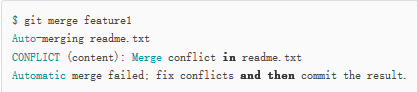

# git 学习中篇
 - ## 三、git分支
     - ### 所谓分支
       - #### 分支简介
         我们已经知道在版本回退中，git将每次提交穿成一条时间线，这条时间线就是一个分支，截至目前git里边就只有一条分支，这个分支就是git的主分支，这个分支就是master，实际上HEAD指向的是这个主分支，而主分支指向的是提交 
         一开始，HEAD指向的是主分支即master，而主分支指向的是提交如图4-5： 
          
     - ### 分支的新建与合并
       - #### 分支创建
         每次提交主分支master都向前移动一步，这样随着你不断提交，主分支也越来越长 
         当我们创建分支的时候例如创建dev分支，我们使用代码 
         `$ git branch dev` 创建dev分支 
         `$ git checkout dev` 使HEAD指向dev 
         此时我们可以用一段命令完成分支的创建与指向，如下： 
         `$ git checkout -b dev` 
         现在我们可以在分支dev上进行操作，修改文件，将我们的修改跟踪到暂存区 提交到本地仓 接下来  我们就要的操作就是要合并我们的分支dev到主分支master上边，首先我们需要切换到主分支master上 
         `$ git checkout master` 
         此时HEAD指向如图4-6 
          
         现在我们将dev分支上的贡献合并到主分支上，执行如下命令：
         `$ git merge dev` 
         `$ git merge `命令用于将一个分支合并到当前分支，合并完成后我们可以执行命令`$ git branch -d dev`将dev分支安全的删除掉
       - #### 遇到冲突时的合并操作
         当两个分支在同一个地方同时进行了修改并且提交如图4-7： 
          
         此时git无法进行上边的快速合并，如果执行命令`$ git merge `进行合并, git会抛出一个错误如图4-8： 
          
     - ### 分支的管理
     - ### 利用分支进行的开发工作流程
     - ### 远程分支
     - ### 分支的变基
     - ### 小结
   - ## 四、服务器上的git
     - ### 协议
     - ### 在服务器上部署git
     - ### 生成SSH公钥
     - ### 架设服务器
     - ### 公共访问
     - ### GitWeb
     - ### GitOSis
     - ### Gitolite
     - ### git守护进程
     - ### git托管服务
     - ### 小结
   - ## 五、分布式git
     - ### 分布式工作流程
     - ### 为项目做贡献
     - ### 项目的管理
     - ### 小结
   - ## 六、git工具
     - ### 修订版本安装
     - ### 交互式暂存
     - ### 储藏
     - ### 重写历史
     - ### 使用Git调试
     - ### 子模块
     - ### 子树合并
     - ### 总结
   - ## 七、自定义git
     - ### 配置Git
     - ### Git属性
     - ### Git挂钩
     - ### Git强制策略实例
     - ### 总结
   - ## 八、git与其他系统
     - ### Git与Subversion
     - ### 迁移到Git
     - ### 总结
   - ## 九、git内部原理
     - ### 底层命令和高层命令
     - ### Git对象
     - ### Git References
     - ### Packfiles
     - ### The Refspec
     - ### 传输协议
     - ### 维护及数据恢复
     - ### 总结