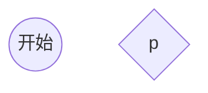
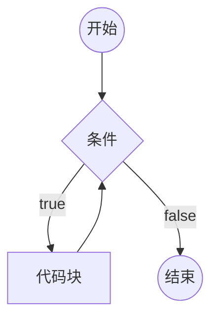
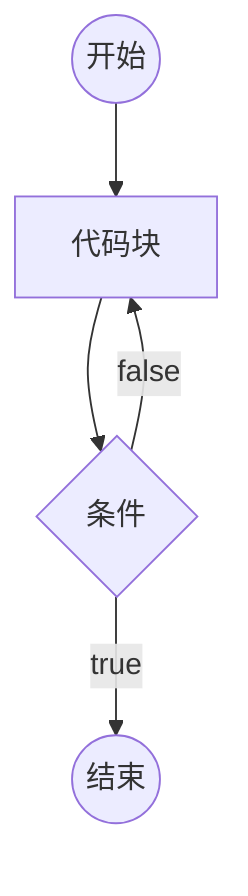
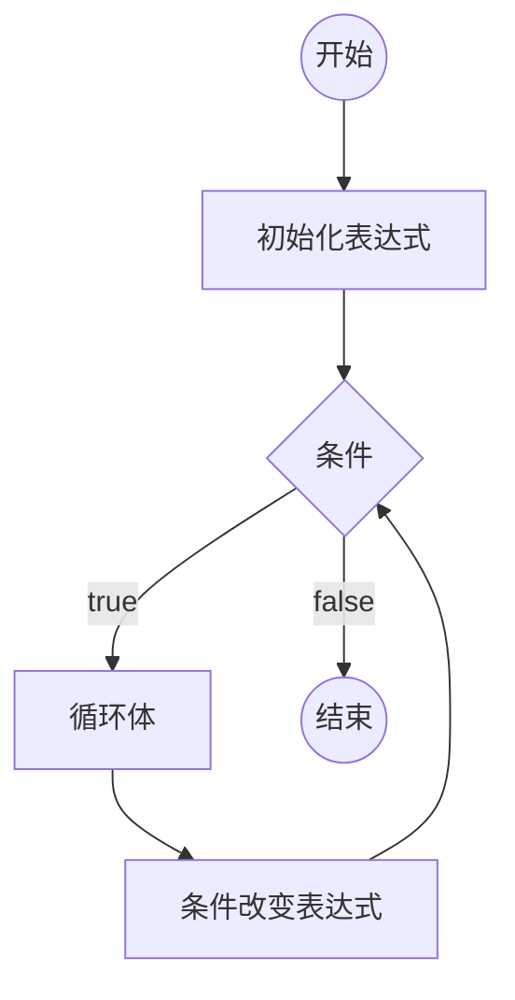

[toc]
# 第一个JS程序
## 浏览器环境中，代码书写的位置:
1.直接书写自页面中的script元素中
2.书写在外部单独的js文件，然后在页面中引用[推介]
   按照引入的script文件顺序进行执行
   代码分离： 内容，样式，功能，三者分离，更加容易维护和阅读
   script标签引入外部文件 元素里边不能书写js代码
   script标签有个默认属性type 是MIME格式
## 认识基础语法
- 语法都必须是英文符号
- js由多条代码组成，代码之间用英文符号结束[并非强制要求]
- js代码从上到下依次同步执行
- js语言大小写敏感
## 认识输出语句
所有的输出语句都不是ES标准。
- document.write, 该语句用于数据输出到桌面
- alert,该语句用于将数据用弹窗的形式显示到桌面
- console.log, 该语句用于将数据打印到控制台
## 认识输入语句
所有的输入语句都不是es标准
## 认识注释
- 双斜杠 //      单行注释
- /*  */    多行注释可以换行


# 数据和数据类型
数据：有用的信息
数据类型：数据的分类
## JS中的数据和数据类型
### 原始值类型
原始类型是指不可再细分的类型

1.数字类型 number
直接可以书写
>了解：
>数字类型可以加上前缀，来表示不同的进制
>0:表示8进制
>0x:表示16进制

2.字符串类型 string
- 单引号 ''
- 双引号 ""
- 反单引号 ``  模板字符串  可以换行
在字符串中表示特殊字符

3.布尔类型 boolean
布尔类型只表示两种状态 ，非黑即白
真 true
假 false

4.undefined类型
表示未定
只有一种书写方式  ： undefined

5.null类型
表示空，不存在。
书写方式  null

>区分某些长数字和字符串，按照读法方式分辩用字符串
>手机号，身份证号 等长数子使用字符串

### 引用类型
引用类型有两种：
- 对象 Object 
可以认为，对象是由多个基本对象类型组合而成
书写对象
**属性**：对象的成员

- 函数

## 得到数据的类型
typeof 操作符
## 字面量
直接书写的具体的数据，叫做字**面量**


# 变量
## 什么是变量
变量四一块内存空间，用于保存数据
>计算机：cpu 内存  硬盘  输入输出设备
>内存：存取数据快 数据易丢失
>硬盘：存取数据慢 数据永久保存
>计算机程序的运行，仅与内存打交道
## 如何使用变量
1.声明（定义）变量
```js
var 变量名;
```
**变量声明后里边存的值是undefined**
2.给变量赋值
- 变量的值是可以变的
变量可以重新赋值，新的值覆盖旧的值
- 变量的名称
在开发中，凡是需要自行命名的位置，叫做标识符
标识符的规范：
1): 以英文字母，下划线，美元$符号开头
2): 标识符中间可以由英文字母，下划线，美元$符号，数字组成
3): 标识符应该要有语义
4): 小驼峰命名法
5): 不可以与关键字和保留词相同
- 声明和赋值合并
- **任何可以书写数据的地方都可以放变量**
- 若使用一个未声明的变量，会导致错误
- **js中存在变量提升
所有的变量都会提升到代码的最顶部 不会超越脚本块
- js中允许变量多个同名变量


# 变量和对象
原始类型：number，string，Boolean，null， undefined
引用类型：object，function
## 在变量中存放对象
1.通过对象读取属性值
```js
对象变量名.属性名
```
**当读取的属性不存在时，会得到undefined**
**当读取属性的对象不存在时，会报错**
2.通过变量，更改对象中的某个属性
**当赋值的属性不存在时会添加属性**
3.删除属性
```js
delete 对象名.属性名
对象.属性名 = undefined;
```
4.属性表达式
给属性赋值，或者读取属性时，可以使用下边的格式读取属性
```js
对象变量["属性名"]
```
- 某些属性名中包含特殊字符
实际上,js对属性名的命名要求并不严格
给属性名加上双引号
**属性的名字只能时字符串  如果是数字，将自动转换为字符串**
## 全局对象
js大部分的宿主环境，都会提供一个特殊对象，该对象可以直接在js代码中访问
，该对象叫做全局对象
在浏览器环境中，全局对象为window，表示整个窗口
全局对象中的所有属性，可以直接使用，而不需要写上全局对象名。
定义的所有全局变量  都会成为window的属性
**如果变量没有赋值，不会覆盖全局对象的同名属性**

# 引用类型
**原始变量里边放的是具体的值**
**引用类型变量存放的是内存地址**
>扩展知识：垃圾回收


# 运算符
## 操作符和操作数
操作符：运算符，参与运算的付号
操作数：参与运算的数据，也称为“元”
操作符不一定只有一个符号
操作符出现在不同的位置可能有不同的含义
## 分类
按照操作数数量区分：
1.一元运算符 ：()   .   []
2.二元运算符： + - * / % =
3.三元运算符：?:
按照功能区分：
1.算术运算符（数字）
2.逻辑运算符
3.位运算符
4.比较运算符
5.其它
## 表达式
表达式 = 操作数 + 操作符

# 算术运算符
数学运算符
1.`+ - * /`
2.`+ -`
3.`%`
4.`++ --`
5.`**`指数
## 细节
1.小数运算是不精确
2.除数为零 
如果被除数是正数，得到结果是Infinity （正无穷）
如果被除数是负数，得到结果是-Infinity（负无穷）
如果被除数是0 ，得到的结果是NaN（not a number，非数字）
isNaN  判断数据是否为NaN
inFinite  判断数据是否为有限
3.求余操作 %
## 其他类型使用算术运算符
1.除加号之外的算术运算符
boolean: true -> 1,false -> 0
string:如果字符串内部的是一个正确的数字，直接变为数字，如果是一个非数字，则得到NaN（能识别Infinity，不能把字符串内部的东西当作表达式）空字符串转换为0，会忽略前后空格
NaN虽然是数字但是与任何数据进行运算都为NaN
null: null -> 0
undefined : undefined -> NaN
将对象类型转换成字符串类型 -> "[object object]"
2.加号运算符
- 只要有一边是字符串 ，那么一定是字符串拼接
 将另外一边的类型，转换成字符串
 数字 -> 数字字符串
 布尔 -> 布尔字符串
 null -> 'null'
 - 加号两边都没有字符串，但一边有对象，将对象转换为字符串，然后按照上边的规则进行计算

 # 自增 自减
 ## 基本
 1.++ 自增一
 2.-- 自减一
 ### 自增自减表达式
 x++ 输出是加之前的值
 ++x 输出是加之后的值
 自减相同

 优先级运算细节：
 1.从左到右依次查看
 2.如果遇到操作数，将数据的值直接取出来
 3.如果遇到相邻的两个运算符，并且左边的运算符优先级大于右边的运算符，则直接运算左边的运算符
 
# 比较运算符
大小比较：< , >, <=, >=
相等运算符：==, !=, ===, !==
**比较运算符的返回类型：boolean**
**算术运算符的优先级高于比较运算符的优先级**
## 大小比较
## 细节
1.两个字符串的比较 比较的是字符串的字符编码
2.如果一个不是字符串，并且两个都是原始数据类型，将他们都转化为数字类型进行比较
NaN与任何数字比较得到的结果都是false
Infinity 比任何数字都大 反之成立
3.如果其中一个是引用类型，将对象转换为原始数据类型 再进行1，2运算
## 相等比较
###  == 普通相等比较  和 != 不等比较
**细节**
1.两边数据类型相同直接比较数据本身是否相同（两个对象比较的是对象的地址）
2.两边的数据的类型不同
1). null和undefined == 成立 相等 和其他任何数据类型比较  不相等。
2). 其他原始类型  先转换成数字再进行比较
3). NaN 与其他任何数据类型进行比较都是false 包括自己本身
4). Infiniy 和 -Infinity， 只能自身和自身相等  和其他一切偶不相等
5). 对象类型比较时 都先转化为原始类型数据进行比较
### === 严格相等比较和 !== 严格不相等
=== 严格相等比较的两边的数据类型和值必须全部相等才能成立
!== 同上
# 逻辑运算符
布尔运算符
## 与（并且）
符号：&&
书写方式：表达式1 && 表达式2
1.将表达式1进行boolean判定
以下数据均判定为false
1). null 
2). undefined 
3). false
4). NaN
5). ''
6). 0
其他的都表示为真
2.如果表达式的判定结果为假，则直接返回表达式1，而不执行表达2，否则返回表达式2的结果
## 或( || )
符号：||
书写方式：表达式1 || 表达式2
只要有一个表达式为真返回真
##非
符号：!
书写方式：!数据
一元运算符
将数据的Boolean判定结果直接取反 返回一定是boolean类型
# 三目运算符
书写方式： 表达式1 ? 表达式2 : 表达式3；
对表达式1进行Boolean判定，如果判定结果为真，返回表达式2；否则返回表达式3；

# 补充知识
## 模板字符串
'' ,  ""   ,  `` 
## 类型转换不会影响原本的数据

## 复合的赋值运算符
+= -= *= /+ **=
## void 运算符
一元运算符
1.普通写法：``` void 表达式 ```
2.函数写法：``` vold(表达式) ```
作用：运行表达式，返回undefined
## 逗号运算符
写法：表达式1,表达式2
依次执行两个表达式，返回表达式2
逗号运算符比赋值运算符优先级低

# 数字的存储
## 问题
1.js中小数运算是精确的吗？
 不一定是精确的
2.js中整数运算是精确的吗？
不一定
3.js中整数表示是连续的吗？
不是，当后边的数字很大的时候不再连续
4.js中表示最大的数是什么？
最大连续整数：
5.js中能表示的有效的位数是多少？
16~17

## 二进制
现实世界中：十进制
计算机：二进制
二进制转十进制：
1101 -> $1*2^3+1*2^2+0*2^1+1*2^0 = 13$
11.01 -> $1*2^1+1*2^0+1*2^{-1}+1*2^{-2}$ = 3.25
十进制转换二进制：
13 -> 1101
```
13 / 2  商 6  余 1
6 / 2   商 3  余 0 
3 / 2   商 1  余 1
1 / 2   商 0  余 1
```
3.25 -> 11.01
整数部分相同
```
小数部分
0.25 * 2  0.5  整数部分 0
0.5 * 2   1.0  整数部分 1
```
# 流程图
标准化的流程，用于描述程序的逻辑
通常用流程图分析程序的流程

# if 
```js
if(条件1){
   //代码块
}else if(条件2){
   //代码快
}else{
   //代码块
}
```
# switch 用法
写法：
```js
switch(表达式)
   case 数据1:
      表达式
   break
   case 数据2:
      表达式
   break
   default:
      代码块
```
表达式的值依次与case后边的数据进行全等比较，如果相等执行后边的表达式，添加关键字break 可以跳出当前计算步骤后边的代码将不会执行
default可以省略

# 循环
for循环， while循环， do-while循环
## while 循环
```js
while(条件){
   代码块(循环体)
}
```

如果条件永远成立  或者为true  循环进入死循环

## do-while
至少循环一次循环体
```js
do{
   代码块
}while(条件)
```


## for循环
```js
for(初始化表达式；条件；条件改变表达式){
   循环体
}
```

## 循环控制语句
1.break 当前循环结束后 跳出循环体 循环结束
2.continue 跳过当前循环 继续后边的循环体

## 循环应用
### 累计问题
将1-100 的数字累加
### 查找问题
135到145是否存在能整除26的数字
### 嵌套循环